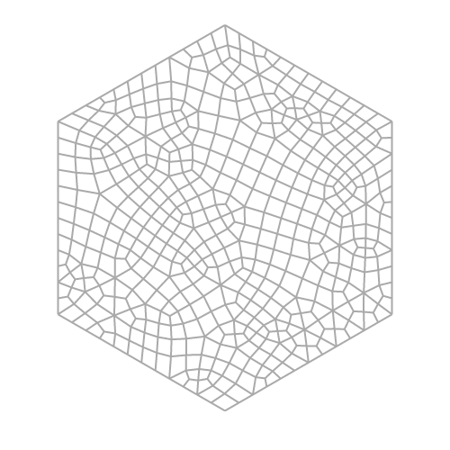

# Hexagrid relaxing

JavaScript port of Cedric Guillemet's implementation of Oskar Stålberg's irregular grid in a hexagon.

Include a few additional custom features (weighted relaxation and force shape to circle).

https://www.kchapelier.com/hexagrid-relaxing/

